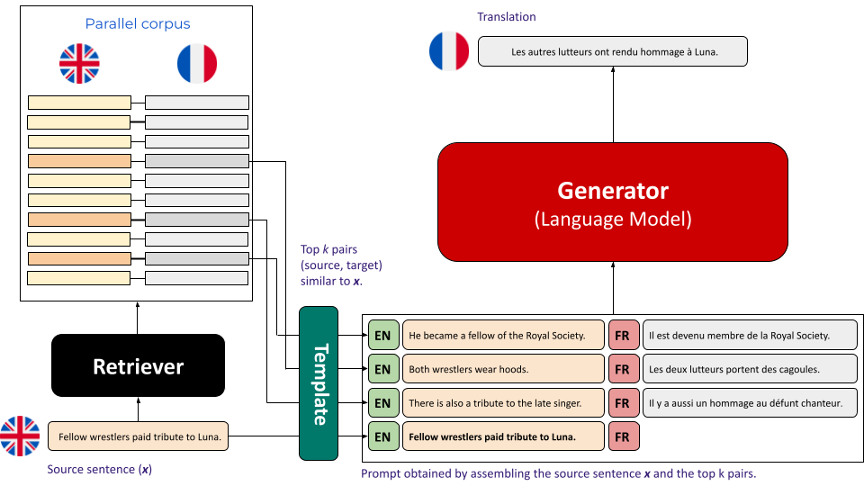

# Official Repo of Example Selection via Similarity Search

Official implementation of the paper [Example Selection via Similarity Search improves Low-resource Machine Translation]() with code, scripts and outputs.

## Setup

The requirements include [PyTorch](https://pytorch.org/get-started/previous-versions/) which should be installed in accordance with the type of GPU available on the device. Following its installation, we recommend to clone the directory in order to use it.

```
git clone https://github.com/ArmelRandy/ICL-MT
cd ICL-MT
pip install -r requirements.txt
```

## Overview



In this paper, we study the impact of carefully chosen in-context demonstrations on the quality of MT outputs. We work with decoder-based LLMs and we study multiple similarity metrics and their impact on the translation task from English to other languages. Given a pool $\mathcal{P} = \{(x_i, y_i) : 1 \leq i \leq |\mathcal{P}| \}$  and a sentence $x$ to translate in $k$-shot, we find $i_1, \ldots, i_k$ such that $\sum_{1 \leq j \leq k}sim(x_{i_j}, x)$ is maximum and use the corresponding pairs as in-context demonstrations. This version of the problem is referred to as **source-to-source (s2s)**. The **source-to-target (s2t)** variant uses $sim(y_{i_j}, x)$ instead of $sim(x_{i_j}, x)$. It is possible to use a mix (**mix**) of both with $\alpha~sim(x_{i_j}, x) + (1 - \alpha)~sim(y_{i_j}, x), \alpha \in ]0, 1[$.

We consider sentence embeddings (SE) based similarity metrics (cosine similarity between sentence representations): [SONAR](https://arxiv.org/abs/2308.11466), [Cohere (Embed V3)](https://cohere.com/blog/introducing-embed-v3), [LaBSE](https://aclanthology.org/2022.acl-long.62.pdf), [Laser 2]() and [E5](https://arxiv.org/pdf/2212.03533). Additionally, we include [BLOOM 7B1](https://huggingface.co/bigscience/bloom-7b1) based embeddings obtained by considering the token-wise average hidden state or the last token's hidden state at the first, the middle or the last layer.

In our experiments, we worked with [FLORES-200](https://huggingface.co/datasets/facebook/flores) using the `devtest` for evaluation and the `dev` as the selection pool. The `dev` vectors for each embedding method mentionned above are pre-computed for English (eng), French (fra), German (deu), Swahili (swh) and Wolof (wol) and can be found in `data/flores` (`dev.bin` and `devtest.bin`). They were obtained with the code `miscellaneous/embedding.py`. Feel free to add any other sentence embedding method; in this case don't forget to add its name to `SUPPORTED_EMBEDDINGS (utils.py)` and follow the same naming convention as the existing ones.

The code also supports other similarity metrics such as [RoBERTa](https://arxiv.org/abs/1907.11692)-based, [BLEU](https://aclanthology.org/P02-1040.pdf), [Rouge](https://aclanthology.org/W04-1013/), [bm25](https://github.com/dorianbrown/rank_bm25), [RBM25](https://arxiv.org/pdf/2212.02437), [LCS POS (Pos)](https://spacy.io/usage/linguistic-features#pos-tagging), [BLEU POS (BLEU_Pos)](https://spacy.io/usage/linguistic-features#pos-tagging) etc. However, these techniques are only implemented in a `s2s` fashion. 

There is also the possibility to jointly use a sentence embedding method with Bm25 via the strategy `{name}+Bm25`. In this setting, we will merge the $k$ examples retrieved by both strategies into a set of $k$ examples with [Borda count](https://en.wikipedia.org/wiki/Borda_count). Finally, the `Random` baseline is also an option.

In our experiments with scaling the pool, we worked with 2 datasets, one for [French](https://huggingface.co/datasets/ArmelRandy/nllb_en_fr_20K) and the other for [Swahili](https://huggingface.co/datasets/ArmelRandy/nllb_en_sw_20K). We embedded them with `SONAR` and stored them in `data/flores`. In `main.py`, you can use the option `augment_pool` to add an extension the FLORES-200 `dev` set, `pool_name` is the name of the `.bin` file containing the vector representations of the extension's sentences (required for SE based retrieval). `pool_dataset_name_or_path` is the path to the dataset on [Hugging Face](https://huggingface.co/datasets) (it should contain 2 columns, each named after the code of the language in which the content is written e.g. `en` for English, `fr` for French, `sw` for Swahili). `pool_size` is the total size of `dev + pool extension`.

The implementation supports [Hugging Face](https://huggingface.co/models)'s naming convention for LLMs. It uses `generate` (though it might by pretty slow) and [vllm](https://github.com/vllm-project/vllm) (recommended) via the argument `--use_vllm`. We have a list of supported templates in `templates.py` but we recommend the use of template `11`:

```
English Sentence
I live in Paris
French Translation
J'habite à Paris
###
English Sentence
<sentence to translate>
French translation
```

## Evaluation

We evaluate the translations using a separate code for each metric: [COMET 22](https://huggingface.co/Unbabel/wmt22-comet-da), BLEU and chrF++. This work introduces the **Language-Aware COMET (laCOMET)** which is a variant of COMET robust to empty translations and translations in the incorrect target language. This variant sets the COMET scores of such translations to zero. For this purpose, we use [FastText](https://huggingface.co/facebook/fasttext-language-identification) for LID. The evaluation script is for laCOMET and COMET is `comet_eval.py`. You can obviously evaluate your generations with classic metrics such as BLEU and chrF++ which are both supported by [sacrebleu](https://github.com/mjpost/sacrebleu).


## Quickstart

A quick usage of this codebase involves translating from English to Swahili with [gemma-2b](https://huggingface.co/google/gemma-2b), in 10-shot. We can do it in `s2s` (or in `mix`, by adding `--alpha 0.5` for example) with few-shot examples selected by `SONAR` embeddings. When located in `ICL-MT`, you can use the following command.

```
torchrun \
    --rdzv-backend=c10d\
    --rdzv-endpoint=localhost:29500\
    main.py \
    --model_name_or_path google/gemma-2b\
    --tokenizer_name_or_path google/gemma-2b\
    --data_path ./data/flores\
    --k 10\
    --src English\
    --tgt Swahili\
    --template_key 11\
    --seed 122\
    --request_batch_size 64\
    --num_beams 2\
    --max_new_tokens 100\
    --temperature 0.0\
    --top_p 1.0\
    --repetition_penalty 1.0\
    --max_samples 1012\
    --strategy SONAR\
    --output_path ./out/gemma-2b/SONAR\
    --format s2s\
    --use_vllm\
```
You can use other launchers such as `accelerate launch`, `python -m torch.distributed.launch`, `python -m` etc.

`--max_samples` indicates the number of `devtest` sentences to translate, it is useful for debugging or to quickly get some results. `--data_path` is the path to the pre-computed representations of the sentences. This code will create a folder named after the translation direction in `--output_path` (`Eng_to_Swh` in this case) in which there will be the JSON containing the translations. 

We can evaluate the translations with `Language-Aware COMET` using the following command.

```
torchrun \
    --rdzv-backend=c10d\
    --rdzv-endpoint=localhost:29500\
    comet_eval.py \
    --model_name_or_path Unbabel/wmt22-comet-da\
    --batch_size 64\
    --language_identifier_name_or_path facebook/fasttext-language-identification\
    --data_dir ./out/gemma-2b\
    --output_dir ./out/gemma-2b/comet_la_scores\
    --empty\
```

If you do not specify `--language_identifier_name_or_path`, it will compute vanilla COMET-22. You can make use of `eval.ipynb` in order to get the BLEU and chrF++ scores of your generations. `sb.ipynb` provides the same services with many more visualization utilities.

## Experiments of the paper

For a LLM of interest, it is possible to replicate our experiments by simply using bash variables which take all the values that we tested. For example you can use [LLaMA 3 8B](https://huggingface.co/meta-llama/Meta-Llama-3-8B), set `--output_path` to start with `./generations/llama-3-8b` and use the following template.

```bash
MODEL_NAME_OR_PATH=$1 # e.g. meta-llama/Meta-Llama-3-8B
TOKENIZER_NAME_OR_PATH=$2 # e.g. meta-llama/Meta-Llama-3-8B
K=$3 # e.g. 1, 2, 5, 10, 20, 32 etc.
SRC=$4 # e.g. English
TGT=$5 # e.g. French, German, Swahili, Wolof
STRATEGY=$6 # e.g. SONAR, LaBSE, bm25 ... 
FORMAT=$7 # e.g. s2s, s2t
PORT_ID=$8 # e.g. 29500
SEED=$9 # 122
TEMPLATE_KEY=${10} # 11

ARGS="\
    --model_name_or_path $MODEL_NAME_OR_PATH\
    --tokenizer_name_or_path $TOKENIZER_NAME_OR_PATH\
    --data_path ./data/flores\
    --k $K\
    --src $SRC\
    --tgt $TGT\
    --template_key $TEMPLATE_KEY\
    --seed $SEED\
    --request_batch_size 64\
    --num_beams 2\
    --max_new_tokens 100\
    --temperature 0.0\
    --top_p 1.0\
    --repetition_penalty 1.0\
    --max_samples 1012\
    --strategy $STRATEGY\
    --output_path ./generations/llama-3-8b/$STRATEGY\
    --format $FORMAT\
    --use_vllm\
    "

torchrun \
    --rdzv-backend=c10d\
    --rdzv-endpoint=localhost:$PORT_ID\
    main.py \
    $ARGS \
```
The scaling experiments require to add the following arguments (for Swahili).

```bash
    --augment_pool\
    --pool_name pool_nllb_en_to_sw\
    --pool_dataset_name_or_path ArmelRandy/nllb_en_sw_20K\
    --pool_size $POOL_SIZE\
```

with `POOL_SIZE in [10, 100, 500, 997, 1997, 1997, 5997, 10997, 20997]`. Usually we adapted `--output_path` to `./generations/llama-3-8b/scaling/$POOL_SIZE/$STRATEGY`. 

We use jupyter notebooks for data visualization. In `analysis.ipynb`, you can find the code to compute the overlap between the choices of different sentence embeddings. It also helps to compute the vendi scores of each pool compositions (`histogram.py` derives the average perplexity). `sb.ipynb` contains the code to compare the retrieval approaches in `s2s`, `s2t` etc. and to plot the pool diversity figure.


All the outputs of our experiments can be found in the folder `generations`.

## Closing thoughts

This repository is an easy tool to perform few-shot machine translation with example selection via similarity search. Although all of our experiments involved translating from English to French, German, Swahili or Wolof; you can use this code to translate from English to any FLORES-200 language (see `./data/flores200.jsonl`). This is possible with Template 11 and in `s2s`.

## Citations

If you found this repository or its outputs to be useful, don't hesitate to cite.

```
```

## Acknowledgments

This work was made possible by the INRIA Paris' NLP research team, [ALMAnaCH](https://almanach.inria.fr/index-en.html).
